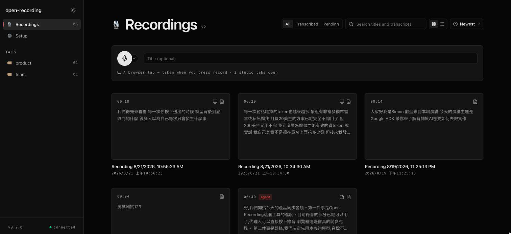
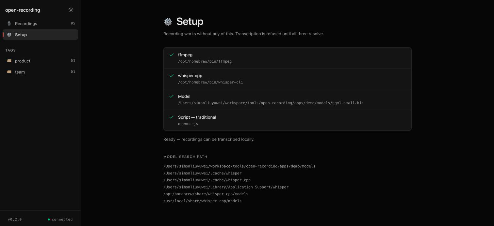
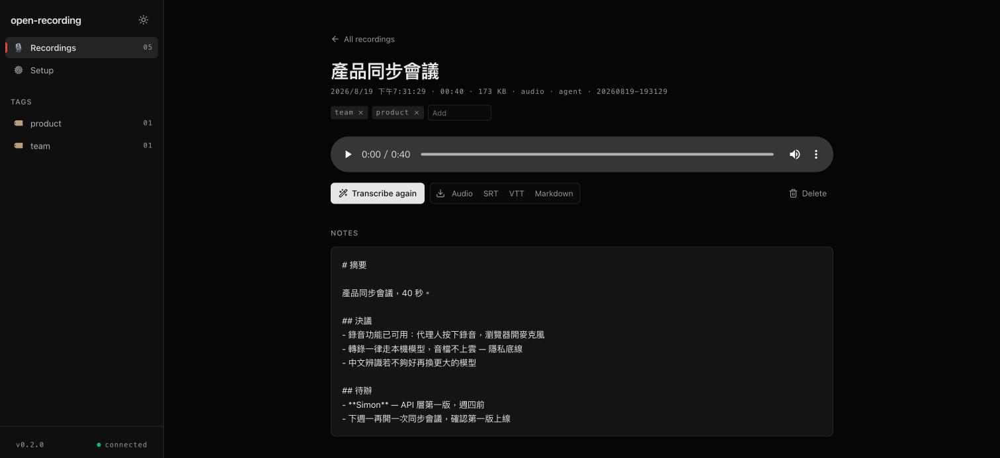
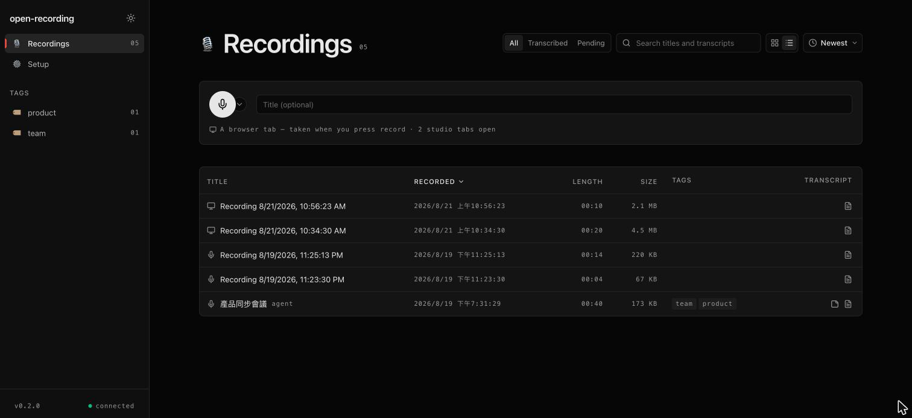

# open-recording

[](https://github.com/simonliu-ai-product/open-recording/actions/workflows/ci.yml)
[](https://www.npmjs.com/package/@open-recording/core)
[](https://github.com/simonliu-ai-product/open-recording/stargazers)
[](https://opensource.org/licenses/MIT)

[English](README.md) · **繁體中文**

在瀏覽器錄音，在本機轉錄，讓 agent 兩件都能自己來。

`open-recording` 給 AI agent 一顆真正的錄音鍵：它按下開始，瀏覽器裡的工作室頁面接管麥克風；它按下停止，音檔就落在你的磁碟上，並交給 whisper.cpp 轉錄——音訊完全不離開這台機器。

架構與 [open-doc](https://github.com/simonliu-ai-product/open-doc)、open-slide 同源：一台 Vite dev server、一層 `ops`，以及掛在上面的 MCP endpoint。

```bash
npx open-recording dev --mcp
```



<sub>工作室。每段錄音都是一張卡片，上面是逐字稿的開頭幾句——一段錄音的內容是它說了什麼，不是一條波形圖。</sub>

## 快速開始

```bash
pnpm install
pnpm dev:demo            # 工作室在 http://localhost:5274，MCP 在 /mcp
```

在瀏覽器開啟工作室，於側邊欄底部按一次 **Arm microphone**。頁面會保留這個授權，所以 agent 之後要錄音時不必再等任何權限提示。

要轉錄的話：

```bash
brew install whisper-cpp ffmpeg
mkdir -p models && curl -L -o models/ggml-large-v3-turbo.bin \
  https://huggingface.co/ggerganov/whisper.cpp/resolve/main/ggml-large-v3-turbo.bin
npx open-recording doctor   # 確認 ffmpeg、執行檔與模型都到位
```

`doctor` 會把每一項缺件的修法一併印出來。少了這些仍然可以錄音，只有轉錄會被拒絕。



<sub>同一套檢查，在工作室裡的樣子。少了執行檔或模型，是一個附帶修法的設定問題，而不是一段悄悄轉錄失敗的錄音。</sub>

## agent 怎麼使用它

把你的 agent 指向 MCP endpoint（`http://localhost:5274/mcp`），然後：

| 工具 | 作用 |
| --- | --- |
| `recorder_status` | 現在有沒有東西在錄，以及有沒有工作室可以錄 |
| `start_recording` | 按下錄音。只有在瀏覽器確認麥克風已開啟後才回傳 |
| `stop_recording` | 停止並收尾；帶 `transcribe: true` 就立刻跑 whisper |
| `cancel_recording` | 停止並把音檔丟掉 |
| `transcribe_recording` | 對一段錄音跑 whisper.cpp |
| `read_transcript` | 帶時間戳的 Markdown、純文字，或帶時間的片段 |
| `search_transcripts` | 跨所有逐字稿的子字串搜尋，附毫秒位移 |
| `write_notes` / `read_notes` | 把摘要或待辦寫在音檔旁邊 |
| `list_recordings` / `read_recording` / `rename_recording` / `tag_recording` / `delete_recording` | 日常整理 |
| `transcription_environment` | whisper/ffmpeg/模型各自解析到什麼——遇到 503 就讀這個 |

典型的一輪：`start_recording` → 會議進行 → `stop_recording {transcribe: true}` → `read_transcript` → 用 `write_notes` 寫下摘要。

`start_recording` 會等到工作室頁面回報 `MediaRecorder` 真的跑起來才回傳。如果分頁被關掉、或麥克風被擋，agent 收到的是一個講明原因的拒絕——絕不會為一段根本沒在錄的錄音回報成功。



<sub>單一錄音，以及 agent 會後寫進 <code>notes.md</code> 的摘要。音檔、字幕與 Markdown 都從這裡下載。</sub>

## CLI

```bash
open-recording dev --mcp        # 工作室 + MCP endpoint
open-recording list             # 列出每一段錄音
open-recording show <id>        # 印出它的逐字稿
open-recording transcribe --all # 把還沒轉錄的補完
open-recording search "排程"     # 在逐字稿裡搜尋
open-recording doctor           # 檢查本機工具鏈
open-recording rm <id>          # 刪除
```

## 磁碟上長什麼樣

```
recordings/
  20260819-141530-weekly-sync/
    meta.json        標題、長度、大小、標籤、轉錄細節
    audio.webm       瀏覽器錄到的東西
    transcript.json  帶時間的片段
    transcript.md    帶時間戳的 Markdown——agent 讀回去的就是這份
    notes.md         agent 寫在這裡的任何東西
```

沒有資料庫，也沒有索引。檔案系統就是事實本身，而 id 本身就依時間排序。



<sub>同一份目錄列表，換成表格。任一欄位標題都能排序；左邊的圖示標明這段錄音來自麥克風還是分頁。</sub>

## 錄一個瀏覽器分頁

在側邊欄按 **Record a tab** 並挑一個分頁。你會得到它的畫面；如果勾了 *Also share tab audio*，也會得到它的聲音——輸出是一個 `screen.webm`，跟其他錄音一樣會被轉錄、加字幕。

挑分頁這件事是人的工作：Chrome 不允許腳本選擇擷取來源，而且不像麥克風，它不會記住你的選擇。一旦選定，串流就會留著，agent 可以照常開始、暫停與停止。

在 macOS 上，Chrome 只對**分頁**分享音訊——視窗不行，整個螢幕也不行。沒有音訊的分頁分享仍然會錄下畫面，而工作室會直接說明這件事，不會讓你事後才在空的逐字稿裡發現。

轉錄時會在音檔旁一併寫出 `transcript.srt` 與 `transcript.vtt`，播放器也會載入這些字幕軌，所以螢幕錄影播放時就帶著字幕。

## 中文逐字稿可以指定輸出繁體

不管講的是什麼，Whisper 一律寫出簡體中文——它的訓練資料壓倒性地偏向簡體——所以一場在台北開的會，會被轉成一種在場沒人使用的字體。設定字體並安裝轉換器：

```bash
pnpm add -D opencc-js
```

```ts
transcribe: { script: 'traditional' }
```

轉換是以詞彙為單位的（`软件` 會變成 `軟體`，而不是 `軟件`），而且發生在 whisper 之後，所以每一行的時間戳都會保留下來。改用 prompt 引導 whisper 產生繁體確實有效，但它會讓 whisper 把整段錄音回成單一片段——這就是這裡選擇轉換而不是引導的原因。

如果設了 `script` 卻少了轉換器，轉錄會被拒絕，而不是默默地用錯的字體寫出來。

## 設定

在你的工作區放一個 `open-recording.config.ts`：

```ts
import type { OpenRecordingConfig } from '@open-recording/core';

export default {
  recordingsDir: 'recordings',
  port: 5274,
  chunkMs: 5000,          // 上傳的切片粒度；分頁當掉最多只損失一片
  maxDurationMs: 7200000, // 工作室到這個長度會自己停下來
  transcribe: {
    language: 'auto',     // 或 'zh'、'en'、…
    model: 'models/ggml-large-v3-turbo.bin',
    threads: 8,
  },
} satisfies OpenRecordingConfig;
```

## 套件

| 套件 | 角色 |
| --- | --- |
| `@open-recording/core` | 工作室 runtime、dev API、錄音狀態機、whisper.cpp 轉錄、CLI |
| `@open-recording/mcp` | 架在同一層 `ops` 之上的 MCP server |

## 致謝

整個架構——由 dev API 與 MCP server 共用的 `ops` 層、以 Vite plugin 形式存在的 dev server、乃至整個 monorepo 的骨架——沿襲自 [@1weiho](https://github.com/1weiho) 的 [open-slide](https://github.com/1weiho/open-slide)，並經由 [open-doc](https://github.com/simonliu-ai-product/open-doc) 轉手而來。工作室的雙欄外殼與它的設計語言——中性的零彩度色階、唯一的朱紅重點色、`.eyebrow` 與 `.folio` 兩種字體樣式——則是直接取自 open-slide。

## 授權

MIT
